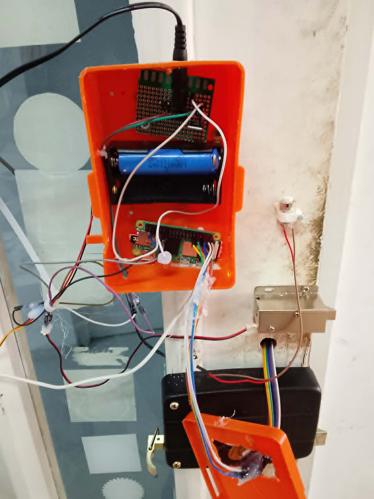
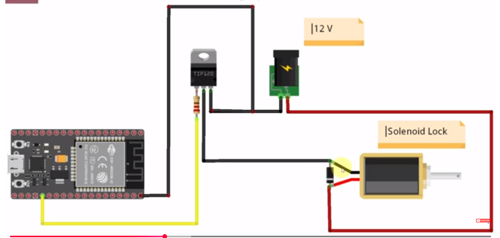
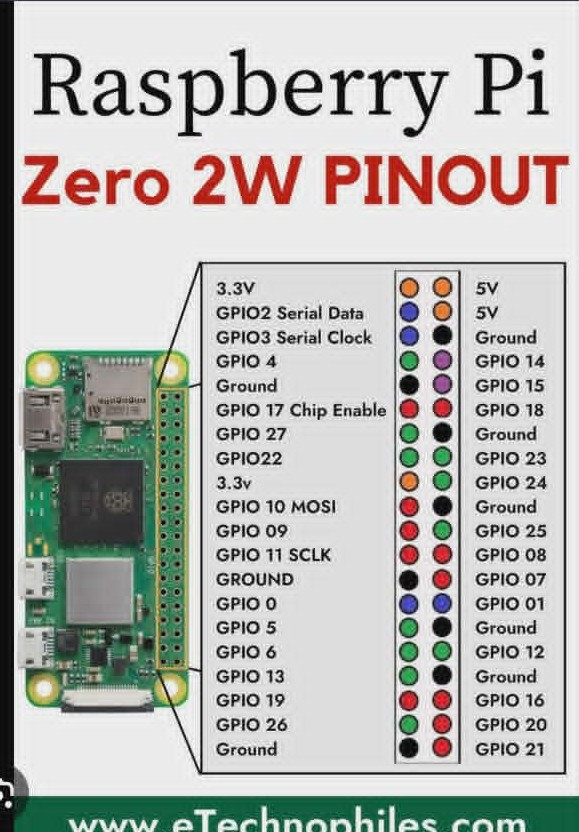

# Secure-Entry Smart Door System

Secure-Entry is a Raspberry Pi-based access control system that combines keypad PIN authentication, face recognition, and remote control through Firebase. The system controls a solenoid door lock and sends alerts when unauthorized access attempts are detected.

## Features

- PIN-based door unlocking using a 4x4 keypad
- Face recognition using OpenCV LBPH
- Remote door opening through Firebase Realtime Database
- Email and WhatsApp notifications for incorrect PIN attempts
- Solenoid lock control with a physical push button
- Local and remote access management

## Project Structure

- `main.py` – Main door controller (GPIO, keypad, Firebase, notifications)
- `save.py` – Capture face images for a user
- `augment.py` – Perform face image augmentation
- `train.py` – Train the LBPH face recognition model and save labels
- `detect_face.py` – Real-time face detection and recognition
- `images/` – Hardware wiring and assembly photos
- `demo.mp4` – Demonstration video

## Hardware Requirements

- Raspberry Pi Zero 2 W
- Camera Module or USB Camera
- 4x4 Matrix Keypad
- Push Button
- Solenoid Door Lock
- 12V Power Supply
- TIP120 (or equivalent NPN transistor)
- Flyback Diode (1N4007 or equivalent)
- Jumper Wires and Resistors

## Wiring Notes

- The solenoid lock is controlled through an NPN transistor with a flyback diode.
- Use a separate 12V power supply for the lock.
- Connect the Raspberry Pi ground and 12V power supply ground together.

### GPIO Configuration

| Component | GPIO Pin |
|------------|-----------|
| Solenoid Lock | GPIO 17 |
| Push Button | GPIO 26 |
| Keypad Rows | GPIO 6, 5, 19, 13 |
| Keypad Columns | GPIO 21, 20, 16, 12 |

## Software Requirements

- Python 3.9+
- OpenCV Contrib (`cv2.face`)
- NumPy
- Firebase Admin SDK
- Twilio
- RPi.GPIO

### Installation

```bash
python -m pip install opencv-contrib-python numpy firebase-admin twilio RPi.GPIO
```

## Setup

### 1. Create the Face Dataset

```text
known_faces/
└── person_name/
    ├── image1.jpg
    ├── image2.jpg
    └── ...
```

### 2. Configure Credentials

Update the following parameters in `main.py`:

- Password
- Firebase service account key
- Firebase database URL
- Email credentials
- Twilio credentials

### 3. Haar Cascade

The required Haar Cascade file will be downloaded automatically if it is missing.

## Usage

### Capture Face Images

```bash
python save.py
```

### Augment Images (Optional)

```bash
python augment.py
```

### Train the Model

```bash
python train.py
```

### Test Face Recognition

```bash
python detect_face.py
```

### Run the Complete Door System

```bash
python main.py
```

## Demo and Report

### Demo Video

https://drive.google.com/drive/folders/1_1uyPSZ0tulJLGlMxORozhvnuZMWxBsU

### Project Report

https://drive.google.com/drive/folders/1nSCV6HwBXUD6e2LcyMuNfCZ53oxWeRsh

## Images

### Door Prototype



### Wiring Diagram



### Raspberry Pi Pinout



## Troubleshooting

### cv2.face Not Found

```bash
pip uninstall opencv-python
pip install opencv-contrib-python
```

### Camera Not Detected

- Verify camera connections.
- Check permissions.
- Try another OpenCV backend.

### GPIO Permission Error

```bash
sudo python main.py
```

## Safety Notice

!! This project controls a real door lock.

Before connecting the 12V power supply:

- Verify all wiring carefully.
- Test the circuit before connecting the lock.
- Ensure the flyback diode is installed correctly.
- Verify that the transistor can handle the lock current.

Incorrect wiring may damage the Raspberry Pi or lock system.

## Future Improvements

- Mobile application
- Deep-learning face recognition
- Visitor management
- Access history logs
- Multiple authentication levels
- Video intercom integration

## Author

**Ilyes Saddi**

Secure-Entry Smart Door System  
Built with Raspberry Pi, Python, OpenCV, Firebase, and Twilio.
